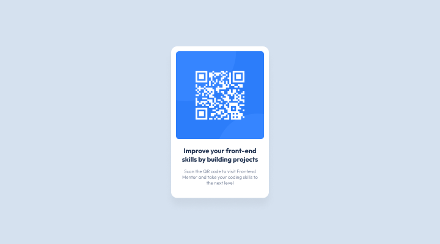

# Frontend Mentor - QR code component solution

This is a solution to the [QR code component challenge on Frontend Mentor](https://www.frontendmentor.io/challenges/qr-code-component-iux_sIO_H).

## Table of contents

- [Overview](#overview)
  - [Screenshot](#screenshot)
  - [Links](#links)
- [My process](#my-process)
  - [Built with](#built-with)
  - [What I learned](#what-i-learned)
- [Author](#author)

## Overview

To build out this QR code component and get it looking as close to the design as possible.

### Screenshot

### Links

- Solution URL: [Frontend Mentor](https://www.frontendmentor.io/solutions/qr-code-component-use-only-html-and-css-yD34R8eehM)
- Live Site URL: [Github Pages](https://kayyrbeks.github.io/frontendmentor-challenges/01-newbie/01-qr-code-component/)

## My process

### Built with

- Semantic HTML5 markup;
- CSS custom properties;
- Flexbox.

### What I learned

I learned more about relative (em, rem) and absolut (px) CSS units and how this units affect the display of content and design.

## Author

- Frontend Mentor - [@kayyrbeks](https://www.frontendmentor.io/profile/kayyrbeks)
- Telegram - [@kayyrbeks](https://t.me/kayyrbeks)
