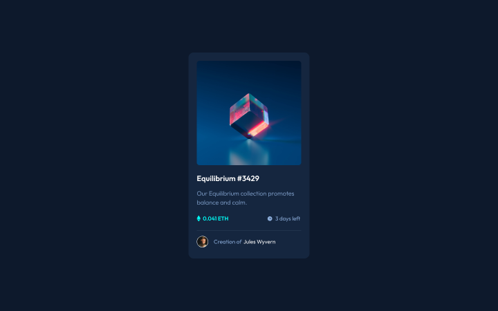

# Frontend Mentor - NFT preview card component solution

This is a solution to the [NFT preview card component challenge on Frontend Mentor](https://www.frontendmentor.io/challenges/nft-preview-card-component-SbdUL_w0U).

## Table of contents

- [Overview](#overview)
  - [Screenshot](#screenshot)
  - [Links](#links)
- [My process](#my-process)
  - [Built with](#built-with)
  - [What I learned](#what-i-learned)
- [Author](#author)

## Overview

To build out this NFT preview card component and get it looking as close to the design as possible.

### Screenshot



### Links

- Solution URL: [Frontend Mentor](https://www.frontendmentor.io/solutions/nft-preview-card-component-use-only-html-and-css-y0xIFVaRuA)
- Live Site URL: [Github Pages](https://kayyrbeks.github.io/frontendmentor-challenges/01-newbie/03-nft-preview-card-component/)

## My process

### Built with

- Semantic HTML5 markup;
- CSS custom properties;
- Flexbox.

### What I learned

I learned how to add hover to a link images. Below you can see my code example.

```Code example
.image-container .image-link:hover::before {
  content: "";
  position: absolute;
  width: 100%;
  height: 100%;
  background: url("./assets/images/icon-view.svg") no-repeat center center;
  background-color: rgba(0, 255, 248, 0.5);
}
```

It was difficult for me to understand🤔.

## Author

- Frontend Mentor - [@kayyrbeks](https://www.frontendmentor.io/profile/kayyrbeks)
- Telegram - [@kayyrbeks](https://t.me/kayyrbeks)
