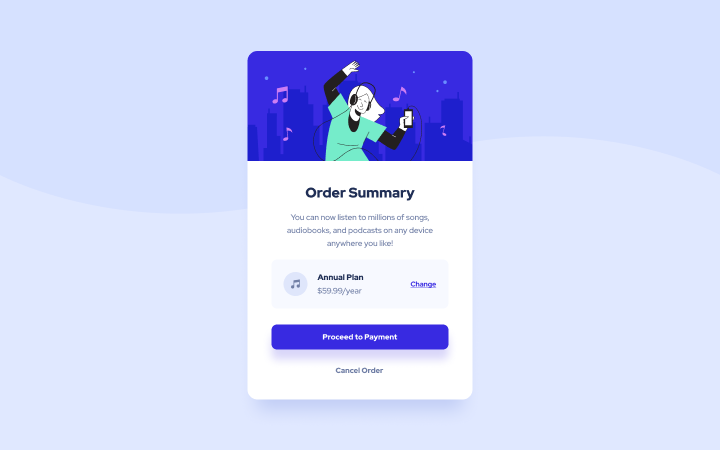

# Frontend Mentor - Order summary card solution

This is a solution to the [Order summary card challenge on Frontend Mentor](https://www.frontendmentor.io/challenges/order-summary-component-QlPmajDUj).

## Table of contents

- [Overview](#overview)
  - [Screenshot](#screenshot)
  - [Links](#links)
- [My process](#my-process)
  - [Built with](#built-with)
  - [What I learned](#what-i-learned)
- [Author](#author)

## Overview

To build out this Order summary card and get it looking as close to the design as possible.

### Screenshot



### Links

- Solution URL: [Frontend Mentor](#)
- Live Site URL: [Github Pages](https://kayyrbeks.github.io/frontendmentor-challenges/01-newbie/04-order-summary-component/)

## My process

### Built with

- Semantic HTML5 markup;
- CSS custom properties;
- Flexbox.

### What I learned

I learned how to position background image. Below you can see my code example.

```Code example
main::before {
  width: 100vw;
  min-height: 100vh;
  content: "";
  position: absolute;
  background-image: url("./assets/images/pattern-background-desktop.svg");
  background-position: center 0;
  background-size: 100% 50%;
  background-repeat: no-repeat;
  top: 0;
  left: 0;
  z-index: -1;
}
```

I searched a long time how to position image with *background-size* and other background image propeties. It was difficult for me to understand🤔.

## Author

- Frontend Mentor - [@kayyrbeks](https://www.frontendmentor.io/profile/kayyrbeks)
- Telegram - [@kayyrbeks](https://t.me/kayyrbeks)
