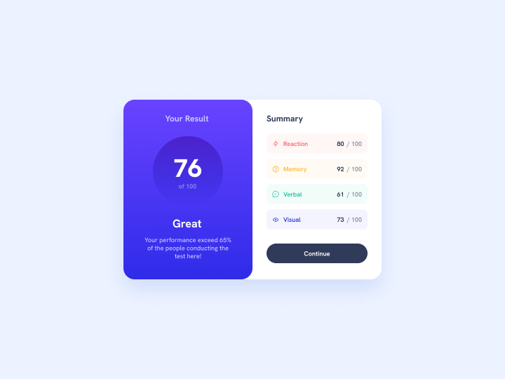

# Frontend Mentor - Results summary component solution

This is a solution to the [Results summary component challenge on Frontend Mentor](https://www.frontendmentor.io/challenges/results-summary-component-CE_K6s0maV).

## Table of contents

- [Overview](#overview)
  - [Screenshot](#screenshot)
  - [Links](#links)
- [My process](#my-process)
  - [Built with](#built-with)
  - [What I Learned](#what-i-learned)
- [Author](#author)

## Overview

To build out this Results summary component and get it looking as close to the design as possible.

### Screenshot



### Links

- Solution URL: [Frontend Mentor](https://www.frontendmentor.io/solutions/results-summary-component-use-only-html-and-css-4Iu_K1DVKv)
- Live Site URL: [Github Pages](https://kayyrbeks.github.io/frontendmentor-challenges/01-newbie/07-results-summary-component/)

## My process

### Built with

- Semantic HTML5 markup;
- CSS custom properties;
- Flexbox.

### What I learned

I learned to add font to CSS. Below you can see my code example.

```Code example
@font-face {
  font-family: "HankenGrotesk";
  src: local("HankenGrotesk Medium"), local("HankenGrotesk-Medium"),
    url("./assets/fonts/HankenGrotesk-Medium.ttf") format("truetype");
  font-weight: 500;
}
```

## Author

- Frontend Mentor - [@kayyrbeks](https://www.frontendmentor.io/profile/kayyrbeks)
- Telegram - [@kayyrbeks](https://t.me/kayyrbeks)
